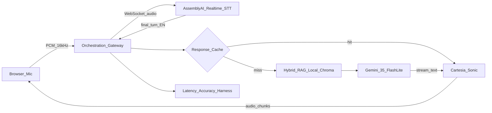
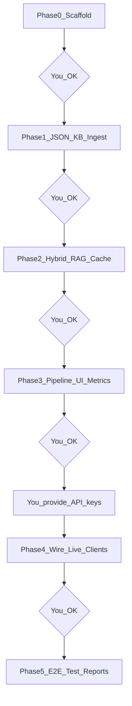

# Realtime Voice Agent + Local RAG Eval Architecture

**Hackathon track (locked):** AssemblyAI **Realtime Speech-to-Text API** as foundation — WebSocket STT, sub-second transcription — then **bring your own orchestration** (LLM + TTS + RAG). Not AssemblyAI’s bundled Voice Agent API.

**Scope:** English only. Da Nang tourism Q&A. Greenfield repo.

**Working rule:** Implement **one phase at a time**. After each phase, stop and report → you OK → next phase. **API keys only in Phase 4–5** (you supply before live test).

---

## Decisions locked

| Decision         | Choice                                                          |
| ---------------- | --------------------------------------------------------------- |
| Track            | Realtime Agent = AssemblyAI Realtime STT + custom orchestration |
| Language         | English only                                                    |
| ASR mode default | `min_latency` (A/B vs `balanced` in eval)                       |
| Vector DB        | **Chroma local** only                                           |
| TTS              | **Cartesia Sonic** (lowest latency)                             |
| LLM              | `gemini-3.5-flash-lite`, `thinking_level=MINIMAL`               |
| KB               | Rich English **JSON** → ingest Chroma + BM25                    |
| Metrics          | Latency waterfall + cache hit/miss + accuracy                   |
| Tone             | `voice_profiles.yaml`                                           |

---

## Architecture



---

## Phased delivery (do in order)



### Phase 0 — Scaffold (no keys)

- Repo layout: `backend/`, `rag/`, `data/`, `config/`, `eval/`, `frontend/`
- `pyproject.toml` / `requirements.txt`, README setup
- `.env.example` with placeholder names only (`ASSEMBLYAI_API_KEY`, `GEMINI_API_KEY`, `CARTESIA_API_KEY`)
- Config skeletons: `voice_profiles.yaml`, app settings
- **Done when:** project boots (`uvicorn` healthcheck), folder structure clear, no real secrets

### Phase 1 — Da Nang JSON KB + local ingest (no keys)

- Author rich English `data/danang_en/documents.json` (attractions, beaches, food, hotels, transport, day trips, practical, events, shopping, weather)
- `rag/ingest_json.py`: JSON → chunks → Chroma PersistentClient + BM25 index
- CLI: `python -m rag.ingest_json`
- **Done when:** Chroma persist dir populated; can `get`/`peek` chunks; doc count reported

### Phase 2 — Hybrid RAG + cache + text demo (no keys for core path\*)

\*Local embedding model download only — no AssemblyAI/Gemini/Cartesia keys.

- Hybrid retrieve: dense Chroma + BM25 + RRF
- Caches: embed / retrieval / answer (in-memory; optional disk)
- Text CLI or simple HTTP: question → retrieved chunks + (mock or local) answer path
- Span timing for `rag_ms`, `cache_hit_ms`
- Cache-hit vs miss micro-bench script
- **Done when:** same query shows miss then hit with large latency drop; retrieval returns sensible Da Nang chunks

### Phase 3 — Orchestration skeleton + mic UI + metrics (no live API calls)

- FastAPI WebSocket gateway + pipeline interfaces: `ASRClient`, `LLMClient`, `TTSClient` (stub/mock implementations)
- Mock end-to-end turn: fake transcript → real RAG → stub LLM text → stub TTS silence/beep or skip audio
- Minimal frontend: mic permission UI, transcript panel, metrics panel
- Metrics JSONL writer + simple waterfall summary command
- Eval dataset stubs under `eval/datasets/` (gold Q, labeled chunk ids)
- **Done when:** you can click mic / send text turn through orchestration without real vendor keys

### Phase 4 — Wire live clients (**you provide keys here**)

You add to local `.env` (never commit / never paste in chat):

- `ASSEMBLYAI_API_KEY`
- `GEMINI_API_KEY`
- `CARTESIA_API_KEY`
- Optional Cartesia `voice_id` / default profile

Then implement:

- AssemblyAI Realtime WebSocket STT (`universal-3-5-pro`, `en`, `min_latency`, keyterms)
- Gemini 3.5 Flash-Lite streaming + grounded short answers
- Cartesia Sonic streaming TTS + voice profiles
- Replace stubs; keep metrics spans on real path
- **Done when:** one live spoken turn works: voice → transcript → RAG → spoken reply

### Phase 5 — Test project + reports (**keys required**)

- Live E2E sessions; collect latency JSONL
- Cache hit/miss bench on live answer path
- ASR WER sample set (if wav/gold available) or transcript spot-check
- RAG Recall@k / faithfulness spot-eval
- Write `reports/` summaries (p50/p95 tables, cache delta, accuracy notes)
- **Done when:** demo-ready agent + measurable Accuracy/Latency artifacts for hackathon

---

## Latency budget (validated in Phase 5)

| Stage         | Metric             | Target p50 / p95 |
| ------------- | ------------------ | ---------------- |
| ASR finalize  | `stt_finalize_ms`  | ≤200 / ≤350      |
| RAG miss      | `rag_ms`           | ≤50 / ≤100       |
| Cache hit     | `cache_hit_ms`     | ≤5 / ≤15         |
| LLM TTFT      | `llm_ttft_ms`      | ≤200 / ≤400      |
| TTS TTFB      | `tts_ttfb_ms`      | ≤50 / ≤100       |
| E2E miss      | `e2e_turn_ms`      | ≤700 / ≤1000     |
| E2E cache hit | `e2e_cache_hit_ms` | ≤250 / ≤400      |

---

## Stack (reference)

| Layer   | Choice                                  |
| ------- | --------------------------------------- |
| Runtime | FastAPI + WebSocket                     |
| ASR     | AssemblyAI Realtime `universal-3-5-pro` |
| LLM     | `gemini-3.5-flash-lite`                 |
| DB      | Chroma local + BM25 + RRF               |
| Embed   | `BAAI/bge-small-en-v1.5`                |
| TTS     | Cartesia Sonic                          |
| Cache   | embed + retrieval + answer              |

---

## Repo layout

```
backend/app/          # gateway, pipeline, metrics
rag/                  # ingest_json, retrieve
data/danang_en/       # documents.json
config/               # voice_profiles.yaml
eval/                 # datasets + run_* scripts
frontend/             # mic UI
reports/              # Phase 5 outputs
.env.example
```

---

## Keys policy

| Phase | Keys needed?                                  |
| ----- | --------------------------------------------- |
| 0–3   | **No** (local embed download only in Phase 2) |
| 4–5   | **Yes** — you supply before we wire/test      |

Do not paste secrets into chat. Put them in `.env` when Phase 4 starts.

---

## Next step

**Awaiting your OK to start Phase 0 (Scaffold only).**  
After Phase 0 is done, report back → you OK → Phase 1, and so on.
