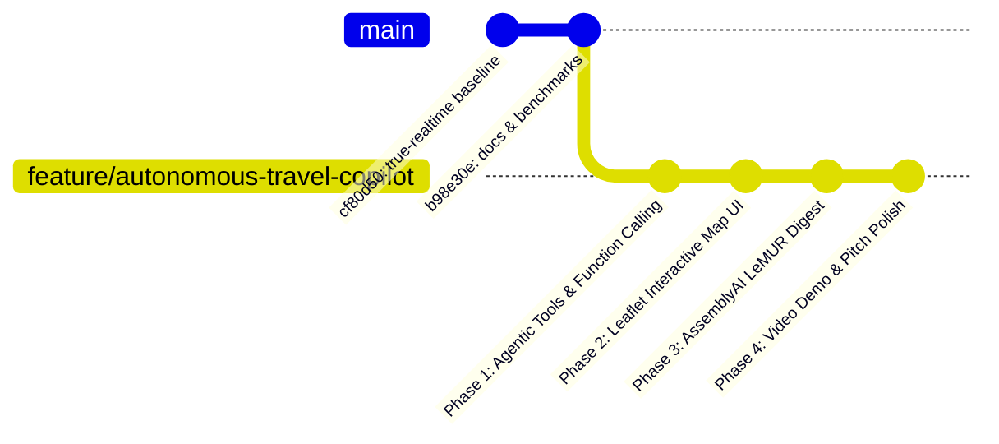

# 🏆 KẾ HOẠCH CHIẾN LƯỢC NÂNG CẤP & TRANH GIẢI VÔ ĐỊCH
## AssemblyAI — Voice Agent Hackathon (Lablab.ai)

> **Tài liệu Chiến lược & Kế hoạch Triển khai (Engineering & Product Roadmap)**  
> **Người lập**: Senior Voice AI Engineer  
> **Mục tiêu**: Nâng tầm dự án từ bản *Initial Setup (Baseline)* thành ứng cử viên cạnh tranh trực tiếp giải **Grand Prize / Category Winner ($10,000 Prize Pool)**.  
> **Nguyên tắc cốt lõi**:
> - **Triển khai trên nhánh riêng (Dedicated Branch)**: Toàn bộ quá trình nâng cấp sẽ được thực hiện trên nhánh độc lập `feature/autonomous-travel-copilot` để tối ưu hóa, giữ an toàn tuyệt đối cho nhánh nền tảng `feature/true-realtime-voice-agent`.
> - **Chi phí 0 Đồng (100% Free / Open-Source / Free-Tier)**: Tuyệt đối không phát sinh thêm chi phí API bên ngoài nào khác ngoài các vendor API keys hiện có (`ASSEMBLYAI_API_KEY`, `GEMINI_API_KEY`, `CARTESIA_API_KEY`).
> - **Bảo toàn Core Engine**: Giữ nguyên nền tảng kỹ thuật xuất sắc hiện tại: True Real-time Full-Duplex qua WebSocket, AssemblyAI Realtime v3 STT, Dual-Layer Barge-in (<650ms) và Watchdog chống treo.

---

## 📊 1. ĐÁNH GIÁ THỰC TRẠNG DỰ ÁN TỪ GÓC NHÌN BAN GIÁM KHẢO

Dựa trên cơ chế chấm điểm tiêu chuẩn của **Lablab.ai** và **AssemblyAI**:

| Tiêu chí Đánh giá | Trọng số | Điểm Hiện tại | Nhận xét Thẳng thắn từ Giám khảo |
| :--- | :---: | :---: | :--- |
| **1. Kỹ thuật Pipeline & Độ trễ (Voice Engineering)** | 25% | **8.5 / 10** | **Điểm mạnh nhất**. Full-Duplex qua WebSocket, độ trễ dứt câu ~0.8s, xử lý RAG+LLM+TTS ~1.38s, TTFB ~2.3s, Dual-Layer Barge-in (<650ms), chống treo ngắt câu bằng Watchdog. Đây là hạ tầng kỹ thuật mà hơn 80% thí sinh khác không đạt được (phần lớn chỉ làm HTTP nửa song công). |
| **2. Khai thác Chiều sâu AssemblyAI (AssemblyAI Depth)** | 25% | **6.0 / 10** | **Chưa khai thác hết tiềm năng**. Hiện mới chỉ dùng `AsyncRealTimeTranscriber` (STT streaming cơ bản) + `word_boost`. Cuộc thi do AssemblyAI tài trợ, BGK tìm kiếm các dự án tích hợp sâu hệ sinh thái của họ: **Audio Intelligence, LeMUR, Sentiment Analysis, Action Items Summary**. |
| **3. Ý tưởng & Tính Thực tiễn (Use Case & Problem Solving)** | 25% | **5.0 / 10** | **Điểm nghẽn lớn nhất (Bottleneck)**. Hiện tại dự án chỉ là "Bot hỏi-đáp du lịch tĩnh" (Passive Q&A) dựa trên file JSON. Những con bot hỏi đáp Wikipedia/du lịch cơ bản xuất hiện hàng trăm bài ở mọi cuộc thi và **hầu như không bao giờ thắng giải lớn** vì thiếu tính hành động (Agency). |
| **4. Trải nghiệm & Độ "WOW" (UI/UX & Interactive Polish)** | 25% | **6.0 / 10** | **Mới dừng ở mức Prototype**. UI chỉ gồm quả cầu năng lượng (Orb) và phụ đề. Khi nghe nói về "Cầu Rồng" hay "Bà Nà Hills", người dùng không thấy bản đồ, không thấy hình ảnh trực quan, không có tương tác hành động. |
| **TỔNG ĐIỂM DỰ ĐOÁN HIỆN TẠI** | 100% | **6.4 / 10** | 👉 **Xếp hạng: Top 25% - 30% (Đủ chuẩn qua vòng loại nhưng trượt giải chung cuộc nếu nộp ngay).** |

---

## 🎯 2. ĐỊNH HƯỚNG MỚI: TỪ "PASSIVE Q&A" SANG "AUTONOMOUS TRAVEL CO-PILOT"

Thay vì là một *"con bot trả lời câu hỏi"*, chúng ta định vị lại sản phẩm thành:  
**"Da Nang Voice Concierge — Autonomous Hands-Free Travel Co-Pilot"**  
*(Trợ lý du lịch rảnh tay tự động hoá, đồng hành cùng du khách quốc tế trong mọi tình huống).*

### Nỗi đau thực tế (Real-World Pain Points) của du khách:
1. **Rào cản thông tin thời gian thực**: "Hôm nay Bà Nà Hills có mưa không?", "Bây giờ đi Cầu Rồng có kịp xem biểu diễn không?".
2. **Bất tiện khi vừa di chuyển vừa bấm điện thoại**: Khách đi bộ/đi xe cần trợ lý đàm thoại rảnh tay (hands-free) dẫn đường và gợi ý trực tiếp.
3. **Rào cản giao tiếp bản địa**: Khách sợ bị chặt chém, không biết giá tiền quy đổi, không biết phát âm đúng tên món ăn địa phương ("Mì Quảng", "Bánh Xèo").

---

## 💡 3. NĂM TÍNH NĂNG "SÁT THỦ" (100% MIỄN PHÍ)

### 🗺️ Tính năng 1: Voice-Driven Interactive Live Map (Bản đồ Trực quan theo Giọng nói)
- **Công nghệ**: **Leaflet.js + OpenStreetMap** (100% mã nguồn mở, không cần credit card hay API key Google Maps).
- **Trải nghiệm**:
  - Khi du khách hỏi: *"Show me the best seafood spots near My Khe Beach"* -> Agent cất tiếng trả lời, đồng thời **bản đồ bên cạnh tự động lướt (`flyTo`) đến Bãi biển Mỹ Khê**, thả các ghim vị trí (pins) quán ăn uy tín kèm giá trung bình và hình ảnh!
  - Khi hỏi: *"How do I go to Marble Mountains?"* -> Bản đồ tự động vẽ lộ trình chỉ đường trực quan.

### ⚡ Tính năng 2: Real-Time Tool Calling (Hệ thống Công cụ Thời gian thực)
Tích hợp cơ chế **Function Calling** vào Gemini 3.5 Flash Lite với các API hoàn toàn 0 đồng:
- **Thời tiết tức thời (Live Weather)**: Dùng **Open-Meteo API** (Hoàn toàn miễn phí, không giới hạn, không cần API key).
  - *User:* "Is it sunny enough to visit Son Tra Peninsula right now?"
  - *Agent:* Tự gọi tool lấy thời tiết hiện tại: *"Currently it's 29°C and clear skies at Son Tra, great for riding up to the peak!"*
- **Quy đổi tỉ giá ngoại tệ (Currency Converter)**: Dùng **ExchangeRate-API** (Gói Free).
  - *User:* "How much is 450,000 VND in USD?"
  - *Agent:* *"450,000 VND is around 18 US Dollars, good for a delicious dinner for two."*
- **Tính khoảng cách & lộ trình**: Tính toán toạ độ địa lý (Haversine Formula) hoàn toàn offline trên server.

### 🧠 Tính năng 3: Post-Session Travel Passport & Action Digest (Vũ khí ăn điểm AssemblyAI!)
- **Khai thác hệ sinh thái AssemblyAI**:
  - Khi kết thúc phiên trò chuyện, kích hoạt gọi API **AssemblyAI LeMUR / Audio Intelligence** (dùng credits hackathon cấp sẵn).
  - Tự động trích xuất:
    - **Lịch trình gợi ý tóm tắt (Customized Itinerary)**.
    - **Danh sách việc cần làm (Action Items)**: Các địa điểm cần ghé, món ăn cần thử.
    - **Phân tích sở thích & cảm xúc du khách (Sentiment Analysis)**.
  - Cung cấp nút tải **"Travel Passport PDF"** hoặc gửi tóm tắt về Telegram (thông qua Telegram Bot API miễn phí).

### 🎫 Tính năng 4: Voice-Activated Action & Reservation Simulation (Đặt bàn & Tour bằng giọng nói)
- Du khách: *"Reserve a table for 2 at Bep Cuon restaurant tonight at 7:00 PM under David."*
- Agent: *"I have noted your reservation at Bep Cuon for 2 people at 7:00 PM. Here is your digital dining voucher."*
- Màn hình lập tức hiển thị **Visual Dining Pass / Voucher** với mã QR thanh toán/xác nhận cực kỳ chuyên nghiệp.

### 🗣️ Tính năng 5: Local Accent & Culinary Pronunciation Coach (Hướng dẫn phát âm bản địa)
- Giúp khách quốc tế phát âm chuẩn xác các món ăn Đà Nẵng: *"How do I pronounce 'Bánh tráng cuốn thịt heo'?"*
- Agent phát âm mẫu chậm rãi, hiển thị phiên âm quốc tế (IPA) và hướng dẫn cách gọi món như người địa phương.

---

## 🛠️ 4. LỘ TRÌNH TRIỂN KHAI (PHASED EXECUTION PLAN)

### 🌿 Chiến lược Phân nhánh Git:
- **Nhánh hiện tại (`feature/true-realtime-voice-agent`)**: Đóng vai trò là **Baseline Ổn định (Production Base)**, giữ nguyên toàn bộ commit sạch, pipeline streaming và báo cáo benchmark đã hoàn thiện.
- **Nhánh mới (`feature/autonomous-travel-copilot`)**: Nhánh triển khai toàn bộ các tính năng Agentic, Map UI và AssemblyAI LeMUR mới.



---

### 📍 Giai đoạn 1: Biến Pipeline thành "Agentic Action Pipeline" (1 – 2 Ngày)
1. **Tool Calling Configuration**:
   - Thêm định nghĩa hàm (Function Declarations) vào `backend/app/pipeline/llm_live.py`:
     - `get_live_weather(lat, lon)` -> Gọi Open-Meteo API (0 key).
     - `convert_currency(amount, from_curr, to_curr)` -> Gọi ExchangeRate-API.
     - `search_places_coords(place_name)` -> Tra cứu toạ độ từ JSON tri thức Đà Nẵng.
2. **WebSocket Event Dispatcher**:
   - Mở rộng giao thức WebSocket `/ws/realtime`: Khi LLM quyết định gọi tool hiển thị bản đồ, server gửi message dạng:
     ```json
     {
       "type": "map_action",
       "action": "fly_to",
       "data": { "name": "My Khe Beach", "lat": 16.061, "lon": 108.246, "zoom": 15 }
     }
     ```

### 📍 Giai đoạn 2: Nâng cấp Giao diện Web Co-Pilot Dashboard (1 – 2 Ngày)
1. **Tích hợp Leaflet.js (OpenStreetMap Tiles)**:
   - Chia bố cục màn hình:
     - **Cột Trái (40%)**: Audio Visualizer Orb + Live Subtitles + Hộp thoại chat.
     - **Cột Phải (60%)**: Bản đồ tương tác Đà Nẵng toàn cảnh, tự động phản hồi theo giọng nói.
2. **Thẻ Trực Quan (Interactive Visual Cards)**:
   - Thẻ thời tiết thời gian thực.
   - Thẻ địa điểm du lịch (Ảnh, giờ mở cửa, địa chỉ).
   - Thẻ đặt bàn / Voucher điện tử.

### 📍 Giai đoạn 3: Tích hợp Sâu AssemblyAI & Post-Call Digest (1 Ngày)
1. **AssemblyAI LeMUR & Audio Intelligence**:
   - Thêm module `backend/app/pipeline/post_call_analytics.py`:
     - Gửi toàn bộ bản transcript của phiên trò chuyện lên endpoint LeMUR của AssemblyAI.
     - Tạo bản tóm tắt tự động: *Key Takeaways*, *Places to Visit*, *Action Items*.
2. **Nút Export Tiện ích**:
   - Tải file tóm tắt lịch trình du lịch cá nhân hóa.

### 📍 Giai đoạn 4: Quay Video Pitch & Hoàn thiện Hồ sơ Dự thi (1 Ngày)
1. **Kịch bản Video Demo 2.5 Phút (Yếu tố quyết định 50% cơ hội thắng)**:
   - **0:00 – 0:20 (Hook)**: Du khách bối rối tại Đà Nẵng, không rảnh tay bấm điện thoại, thông tin rải rác.
   - **0:20 – 1:20 (Live Demo Engine)**: Đàm thoại hai chiều thời gian thực, hỏi thời tiết -> bản đồ tự bay đến địa điểm -> **cố tình nói chen ngang để biểu diễn tính năng Barge-in (<650ms)** (BGK cực kỳ ấn tượng điểm này!).
   - **1:20 – 1:50 (Agentic Action)**: Đặt bàn ăn tối, hiển thị Dining Pass.
   - **1:50 – 2:15 (AssemblyAI Showcase)**: Bấm kết thúc -> AssemblyAI LeMUR phân tích và xuất lịch trình tóm tắt tức thì.
   - **2:15 – 2:30 (Tech Architecture & Closing)**: Trình diễn sơ đồ độ trễ (~2.1s), bảo mật zero-leak và cảm ơn ban tổ chức.

---

## 🛡️ 5. MA TRẬN RỦI RO & PHƯƠNG ÁN KIỂM SOÁT KỸ THUẬT

| Rủi ro Kỹ thuật | Khả năng | Ảnh hưởng | Phương án Kiểm soát & Giải pháp |
| :--- | :---: | :---: | :--- |
| **Độ trễ Tool Calling làm chậm TTFB** | Trung bình | Cao | Lưu cache in-memory kết quả thời tiết và tỉ giá (TTL: 10 phút). Chạy song song Tool execution với câu mở đầu đệm (*"Let me check that for you..."*). |
| **Bản đồ làm lag giao diện Web** | Thấp | Trung bình | Sử dụng Leaflet.js siêu nhẹ (< 40KB), render vector tiles mượt mà, không dùng Google Maps SDK nặng nề. |
| **Xung đột Audio khi phát sinh UI mới** | Thấp | Cao | Giữ nguyên kiến trúc Web Audio Graph và `muteGain (gain=0)` đã kiểm chứng, không can thiệp vào tầng capture mic. |
| **Rate Limit của API ngoài** | Thấp | Trung bình | Open-Meteo không giới hạn rate limit thực tế cho use case hackathon; ExchangeRate-API có 1,500 req/tháng (dư sức chạy kiểm thử). |

---

## 📌 6. CHECKLIST TRƯỚC KHI BẮT ĐẦU TRIỂN KHAI

- [x] Baseline Full-duplex Streaming WebSocket đã kiểm thử đạt chuẩn (<2.3s TTFB, Barge-in <650ms).
- [x] Kế hoạch chiến lược đã được lưu thành văn bản quy chuẩn `HACKATHON_WINNING_PLAN.md`.
- [ ] Tạo nhánh mới `feature/autonomous-travel-copilot` từ nhánh hiện tại.
- [ ] Bắt đầu triển khai Phase 1: Tool Calling & Function Declarations (Free APIs).

> **Lời kết từ Senior AI Engineer**:  
> Dự án hiện tại của chúng ta đã có một **"động cơ phản lực" (Core Engine) cực kỳ tốt**. Việc bổ sung thêm **"vỏ bọc hoàn mỹ" (Agentic Tools, Interactive Map và AssemblyAI LeMUR)** trên một nhánh riêng sẽ biến dự án thành một sản phẩm công nghệ hoàn chỉnh, đủ sức thuyết phục hoàn toàn bất kỳ giám khảo khó tính nào tại Lablab.ai!
