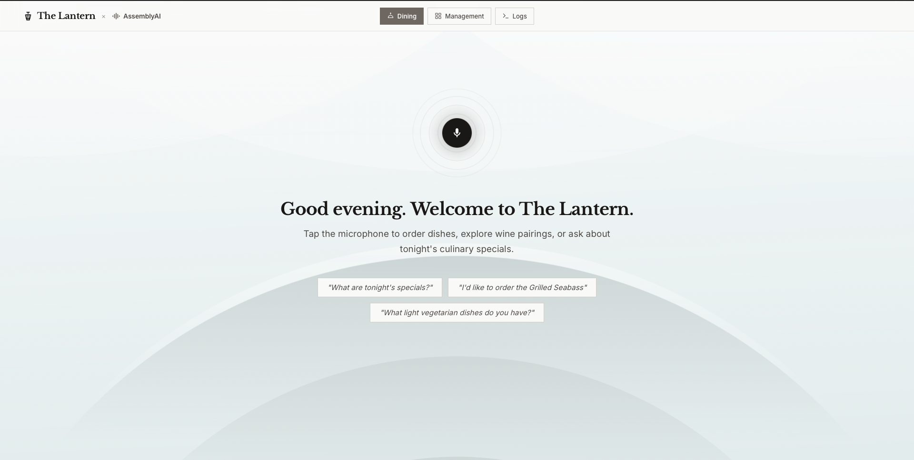
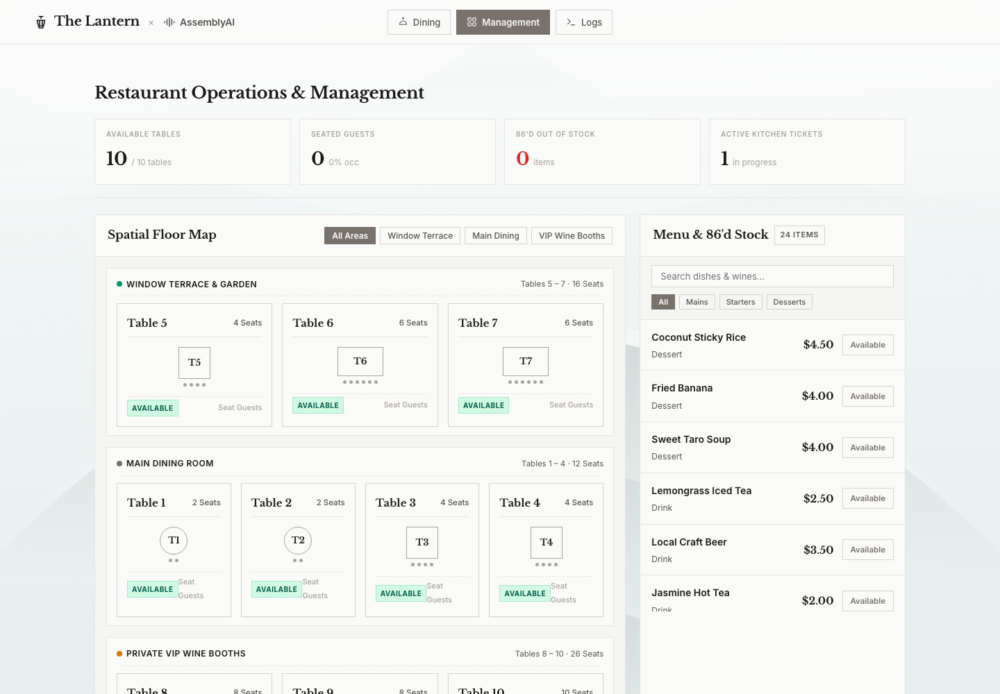
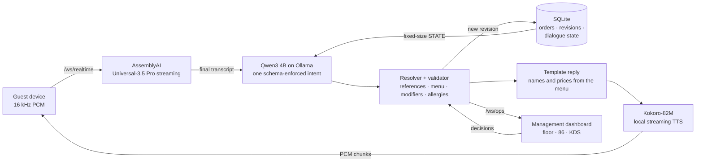

# The Lantern

**A multilingual AI maître d' that takes a full table's order by voice, remembers every word, never invents a dish, and keeps the kitchen in perfect sync. Powered by AssemblyAI, running on local AI.**

Guests speak to a device at their table. The Lantern transcribes them with AssemblyAI streaming, interprets each sentence with a local 4B model, validates every change against the live menu in deterministic code, and answers in the guest's language with a local neural voice. The kitchen sees placed orders and every guest turn live, and can send decisions back to the table.

Built for the AssemblyAI Voice Agent Hackathon by Team Develarper.

| Dining: the guest's table device | Management: floor, 86'd stock and live kitchen tickets |
|---|---|
|  |  |

---

## Why it matters

Taking orders by voice looks easy until the conversation gets real. A guest asks for a
recommendation, says "we'll take those two", asks for something that's sold out, changes their
mind, adds a side and then says "that's all". Each of those steps depends on remembering what
came before.

Small local models are cheap and private, but they lose that thread. When we measured the six
steps above with a local model choosing its own tools, **it completed the order correctly 0 times
in 12** (#26). It told guests it had added dishes it never added, swapped out the wrong item, and
cancelled the order when asked to place it.

The Lantern keeps the small model and changes what it is asked to do.

| For the restaurant | For the guest |
|---|---|
| Orders reach the kitchen only when the guest places them, already validated against the menu, modifiers and allergies | Speak naturally, including "those two", "make it a seabass instead" and "that's all" |
| Sold-out items and kitchen substitutes are handled in the conversation, not at the pass | Answers in their own language, with prices and dish names read from the menu, never invented |
| The model and the waiter's voice run locally: no per-token LLM or per-character TTS fees. Only speech recognition uses a cloud API | A short spoken acknowledgement while the answer is prepared, so there is no dead air |

---

## Results

All figures come from the team's own benchmarks on the six-turn scenario in #26: recommend →
"those two" → a sold-out dish → "instead" → a side dish → "place the order". The correct final
order is 4 dishes, **$36.50**, placed.

### Order accuracy

| Architecture | Machine | Result |
|---|---|---|
| V1: the model chooses among 12 tools (`qwen2.5:3b`, `qwen3:4b`) | RTX 5060 Laptop | **0 / 12** runs correct (#26) |
| V2 before conversation memory (`qwen3:4b`) | RTX 3060 | **0 / 10** (#39) |
| **V2 with code-owned memory (current)** | RTX 3060 | **10 / 10** direct runs, every gate (#39) |
| Same, independent reruns | RTX 5060 · MacBook | **5 / 5** each (#40, #38) |
| Page reload after turn 3 | MacBook | **3 / 3**: the refused dish and the offered pair survive the reload (#38) |

### Full voice pipeline

Five sessions per version on the same machine, driven by synthetic 16 kHz WAVs streamed in real
time. AssemblyAI → Qwen → workflow → Kokoro. Source: #39.

| Metric | Before | **Now** |
|---|---:|---:|
| Six-turn voice sessions completed | 2 / 5 | **5 / 5** |
| Correct final basket, modifiers, total and placement | 0 / 2 | **5 / 5** |
| Sessions where ASR stalled after a failed connect | 3 / 5 | **0 / 5** |
| Transcripts semantically correct | 12 / 12 | **30 / 30** |
| Qwen time after the final transcript, p50 | 2,111 ms | **1,341 ms** |
| First reply audio after the workflow update, p50 | 1,959 ms | **1,752 ms** |
| First reply audio from the start of guest speech, p50 | 7,389 ms | **6,021 ms** |

The last row includes the 2–3 s the guest spends speaking. The prerecorded acknowledgement clips
(see below) are excluded from every latency figure.

### Engineering

- **Flat prompt size.** About 1.46k of the 4,096-token window every turn (#39), whether it's turn 3 or turn 50. The conversation never overflows the model's context.
- **50 automated tests,** including the six-turn scenario, stale references, reload recovery, kitchen-to-guest delivery, the ops feed and the floor map. Mutation checks confirm each safety rule is covered.
- **CI** runs the backend tests and a frontend typecheck and build on every push.

---

## How it works



### 1. The model interprets; code decides

Each turn makes **one** call to Qwen3 4B under Ollama's enforced JSON schema. The model returns an
intent (`recommend`, `create_or_update_order`, `replace_item`, `place_order`, `confirm`, …) and a
reference label such as `offered_all` or `pending` in place of dish IDs it would have to guess.
It never chooses tools, never writes to the order, and never composes the sentence the guest
hears.

### 2. Memory lives in SQLite, not in the context window

A `DialogueState` per table session holds:

- the dishes the waiter just offered;
- the last dish added;
- the question in progress, for example "we refused the squid and offered seabass";
- the last refused dish.

It is saved after every turn and reloaded when a session resumes. Each prompt carries this state
as a compact block of about 300 tokens, so the prompt stays the same size however long the
conversation runs.

### 3. A deterministic resolver and validator

Code turns the model's intent into an order change:

- **"Those two"** resolves from the dishes just offered.
- **"Make it a seabass instead"** after a refusal adds the seabass and removes nothing. The squid never entered the order.
- **"That's all"** places the order. **"Cancel"** asks for confirmation first.
- A modifier is kept only if the guest actually said it. Small models tend to attach every allowed modifier.
- Unknown dishes, unsupported modifiers and **allergen conflicts** are rejected. A sold-out dish comes back with an available alternative.

Every accepted change is an immutable SQLite revision. Kitchen decisions carry `expected_revision`,
so stale actions are refused.

### 4. Replies are rendered from committed state

The guest hears a template filled from the saved revision: items, quantities, total, and what
happens next. The model cannot misquote a price or invent a currency. English and Spanish have
native templates. Other languages pass through a translation step that must keep every dish name
and amount unchanged, or the English text is used.

### 5. The kitchen stays in the loop

The app has three views, all on the same live backend:

- **Dining** is the table device: the listening orb, the guest's words, the waiter's reply, and a live table order.
- **Management** is for staff:
  - KPIs, and a spatial floor map where tables can be seated and cleared.
  - Menu availability: marking a dish 86'd takes effect in the very next guest turn.
  - A **Kitchen Display System**. A ticket appears only once the guest places the order, with modifiers and allergies as notes. **Start Cooking** and **Ready to Serve** are recorded by the backend and spoken to the guest ("The kitchen confirmed your order.", "Your order is ready.").
- **Logs** inspects every turn: what was heard, what the waiter said, the workflow state change, and the latency breakdown. It also shows the other tables' turns as they happen.

The API also supports kitchen-proposed substitutes: the guest hears the proposal and answers by voice.

### 6. No dead air

While Qwen and Kokoro work, the guest device plays a one-second acknowledgement ("Sure, one
moment.", "Let me see what's good tonight."), recorded with the same Kokoro voice and chosen from
the transcript. The real answer queues right behind it.

---

## AssemblyAI integration

- **Universal-3.5 Pro streaming** over a persistent WebSocket, with interim transcripts shown live on the guest device.
- **Keyterms prompting** with 54 terms generated from the menu (dish names and modifiers), so "Bun Bo Hue" and "morning glory" come through intact.
- **Tuned turn detection:** `min_turn_silence=400`, `max_turn_silence=1000`, `end_of_turn_confidence_threshold=0.4`, `format_turns=True`.
- **Barge-in:** `SpeechStarted` cancels the reply in progress and stops playback on the device.
- **Resilient connect:** a 5 s handshake timeout with an explicit retry budget. This fixed the stalls seen in #35.

---

## Tech stack

| Layer | Technology |
|---|---|
| Speech-to-text | AssemblyAI Universal-3.5 Pro streaming (Python SDK ≥ 1.5.4) |
| Language model | Qwen3 4B (Q4_K_M) on Ollama, JSON-schema-constrained output, thinking off |
| Text-to-speech | Kokoro-82M (`hexgrad/Kokoro-82M`), local, streamed as 24 kHz PCM |
| Backend | Python 3.11, FastAPI, WebSockets, Pydantic, SQLite (WAL) |
| Frontend | TypeScript, Vite, Web Audio API (microphone capture and PCM playback) |
| Quality | `unittest` (50 tests), GitHub Actions CI, reproducible benchmark runners |

---

## Quick start

**Requirements:**
- Python 3.10–3.12
- Node 20+
- [Ollama](https://ollama.com)
- An AssemblyAI API key

```bash
python3.11 -m venv .venv && source .venv/bin/activate
pip install -r requirements.txt -r requirements-local-voice.txt
cp .env.example .env            # then set ASSEMBLYAI_API_KEY
ollama pull qwen3:4b
```

**Run** (three terminals):

```bash
ollama serve
uvicorn backend.app.main:app --env-file .env --host 127.0.0.1 --port 8000
cd frontend && npm ci && npm run dev
```

**Open:**
- **Table device:** http://localhost:5173/?table_id=T4. Tap the microphone and speak, or tap a suggestion.
- **Staff:** the same app on another screen, with the **Management** and **Logs** tabs. Table devices on the same Wi-Fi use `http://<this machine's IP>:5173/?table_id=T4`.

`GET /ready` reports `"ready": true` once Qwen and Kokoro are warm. The first start takes 10–20 s.

> **macOS notes.**
> - `requirements-local-voice.txt` includes Japanese and Chinese G2P, which needs a C toolchain. For an English/Spanish demo, `pip install kokoro soundfile numpy "misaki[en]"` is enough.
> - If Kokoro exits with `Error processing file '/Users/runner/.../phontab'`, the bundled `espeakng-loader` wheel for Apple Silicon has a CI build path baked in. Run `brew install espeak-ng` and point misaki at Homebrew's `libespeak-ng.dylib` and `espeak-ng-data`.

**Demo walkthrough:** [`docs/demo/DEMO_SCRIPT.md`](docs/demo/DEMO_SCRIPT.md) is a five-minute script with every line and its expected reply.

---

## API

| Endpoint | Purpose |
|---|---|
| `WS /ws/realtime?table_id=T4[&order_id=…]` | Guest session: PCM or typed transcripts in; transcripts, workflow updates and audio out. Resumes an open order |
| `WS /ws/ops` | Kitchen feed: placed-order snapshot, `order_update`, `kitchen_decision`, `agent_turn` |
| `GET /api/kitchen/orders` · `GET /api/orders/{id}` | Placed orders · one order with its revisions |
| `POST /api/kitchen/orders/{id}/decisions` | `accept`, `reject`, `propose_substitute`, `set_eta`, `mark_ready` (with `expected_revision`) |
| `GET /menu` · `POST /menu/set-available` | Live menu and availability, e.g. marking a dish sold out |
| `GET /floor` · `POST /floor/status` | Tables and their status; seat or clear a table |
| `GET /health` · `GET /ready` | Liveness · provider warm-up state |

---

## Testing and benchmarks

```bash
python -m unittest discover -s tests -v                        # 50 deterministic tests, no GPU needed
python -m eval.benchmarks.restaurant.new_architecture         # deterministic architecture benchmark
python -m eval.benchmarks.restaurant.new_architecture --live --languages en,es --server-url http://127.0.0.1:8000
python tools/generate_fillers.py                              # regenerate the acknowledgement clips
```

Every benchmark run writes an immutable `manifest.json`, `results.json` and `summary.md` under
`reports/restaurant/…/<UTC run id>/`. Measurement boundaries are in
[`docs/operations/benchmarking.md`](docs/operations/benchmarking.md).

---

## Repository layout

```
backend/app/
  domain/restaurant/   menu store, intent models, validation, workflow, SQLite repository,
                       recommender, reference and modifier matching
  providers/           asr/assemblyai_stream.py · llm/ollama.py · tts/kokoro.py
  services/            realtime_session.py, dialogue.py (state + resolver), response_renderer.py
  main.py              FastAPI app, /ws/realtime, /ws/ops, kitchen API
frontend/src/          Dining, Management and Logs views (TypeScript, Web Audio, canvas orb)
frontend/public/audio/fillers/   Kokoro acknowledgement clips + manifest
data/restaurant/       menu (24 dishes), floor (10 tables), service schedule
eval/                  benchmark runners and datasets
tests/                 unit, conversation-flow and WebSocket tests
docs/                  architecture, operations, demo script
legacy/                V1 (Gemini/Cartesia tool-calling) and the earlier travel agent, kept as evidence
```

---

## Limitations and next steps

- **Languages.** English and Spanish are tested end to end. Other Kokoro voices (fr, it, hi, ja, zh, pt-BR) depend on the translation step and haven't been benchmarked.
- **Measurements** use synthetic speech. A live-microphone, noisy-room benchmark is next.
- **Kokoro** currently runs on CPU on our machines. A CUDA build is the cheapest remaining latency win (about 1.7 s from workflow update to first audio).
- **Memory across visits** ("the usual") is a natural extension of the per-session `DialogueState`, keyed by guest rather than table session.

---

## Team Develarper


- **Long Quan Ton** ([@BennedictQuanTon](https://github.com/BennedictQuanTon)) — *Project Lead & AI Engineer (System Architect)*
- **Yoshio Nomura** ([@UniverseScripts](https://github.com/UniverseScripts)) — *AI Engineer (Logic and Reliability)*
- **Khanh Tuong Huynh** ([@khanhtuongnakitomo](https://github.com/khanhtuongnakitomo)) — *AI Engineer (Evaluation and Infrastructure)*
- **Tuan Khoa Vi** — *UI/UX Designer & Project Presenter*
- **Trong Dang Thai** — *UI/UX Designer & Project Presenter*
