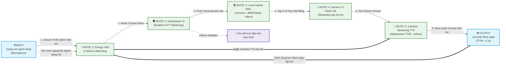

# 🎙️ Da Nang Tourism — True Real-Time Full-Duplex Voice Agent

Trợ lý Thoại Du lịch Đà Nẵng thế hệ mới chuẩn **True Real-time Full-Duplex (Hai chiều liên tục, truyền trực tiếp âm thanh PCM 16kHz, hỗ trợ ngắt lời tức thì Barge-in)** cho cuộc thi **AssemblyAI Voice Agent Hackathon**.

Hệ thống kết hợp khả năng nhận diện giọng nói streaming thời gian thực của **AssemblyAI Realtime STT (v3 SDK)**, kho tri thức du lịch bản địa với **Local Hybrid RAG (Chroma ONNX + BM25Okapi)**, mô hình ngôn ngữ **Gemini 3.5 Flash Lite Streaming**, và bộ tổng hợp giọng nói siêu tốc **Cartesia WebSocket Streaming TTS**.

---

## 📌 1. Giới thiệu Dự án (Project Overview)

- **Mục tiêu**: Cung cấp cho du khách quốc tế một hướng dẫn viên ảo bản địa thông minh, giải đáp mọi thông tin về danh lam thắng cảnh, ẩm thực, lịch trình và mẹo du lịch tại Đà Nẵng bằng tiếng Anh.
- **Trải nghiệm Hội thoại Tự nhiên (Full-Duplex)**: Không cần nhấn giữ nút nói (Push-to-Talk). Người dùng trò chuyện tự nhiên như với người thật, hệ thống tự động phát hiện dứt câu và trả lời ngay.
- **Hỗ trợ Ngắt lời (Barge-in Interruption)**: Khi trợ lý đang nói, người dùng có thể cất tiếng ngắt lời bất cứ lúc nào; hệ thống sẽ lập tức dừng phát âm thanh và chuyển sang lắng nghe câu hỏi mới trong vòng **< 650ms**.
- **100% Bảo mật & Tri thức Đáng tin cậy**: Dữ liệu du lịch được kiểm chứng nghiêm ngặt qua hệ thống Local Hybrid RAG, kèm cơ chế Guardrails chống ảo giác (nếu hỏi ngoài Đà Nẵng hoặc ngoài tri thức, agent từ chối an toàn thay vì tự bịa thông tin).

---

## ⚡ 2. Bảng Chỉ số Hiệu năng & Benchmark (Performance Benchmark)

Dữ liệu được đo kiểm thực tế qua bộ kiểm thử tự động 8 câu hỏi thuộc 3 kịch bản khác nhau (Dễ đến khó, Tình huống thực tế, và Câu hỏi ngoài phạm vi). Chi tiết xem tại báo cáo [`reports/multi_case_evaluation_report.md`](reports/multi_case_evaluation_report.md).

### 📊 Bảng tổng hợp thời gian xử lý trung bình:

| Giai đoạn trong Luồng Xử lý | Thời gian Trung bình (Mean / P50) | Khoảng dao động | Ý nghĩa & Đánh giá |
| :--- | :---: | :---: | :--- |
| ⏱️ **1. Thời gian Nhận diện Ngắt câu (ASR Silence)** | **~799 ms** *(P50: 853 ms)* | 656 ms – 925 ms | AssemblyAI v3 chờ khoảng lặng (~0.8s) để đảm bảo người dùng đã dứt ý, không cướp lời. |
| ⚡ **2. Thời gian Xử lý sau Ngắt câu (Pipeline Latency)** | **1386.7 ms** *(~1.38s)* | 1232 ms – 1535 ms | **Thời gian thực sự của hệ thống** (RAG + LLM Reasoning + TTS Audio First Chunk). Cực kỳ ổn định! |
| 🎙️ **3. Tổng độ trễ Voice-to-Voice (TTFB)** | **2305.4 ms** *(~2.3s)* | 1923 ms – 2400 ms | Tổng thời gian từ lúc người dùng ngưng phát âm đến khi tai nghe thấy tiếng Trợ lý cất lên. |
| 🏁 **4. Tổng thời gian hoàn thành Turn (E2E Turn)** | **3601.8 ms** *(~3.6s)* | 2440 ms – 3757 ms | Từ khi dứt lời đến khi Trợ lý đọc xong trọn vẹn câu trả lời súc tích (< 25 từ). |
| 📚 **5. Tốc độ Tra cứu Tri thức (Local Hybrid RAG)** | **80.3 ms** *(Chroma + BM25)* | 68 ms – 86 ms | Chạy song song CPU đa luồng. Nếu câu hỏi lặp lại (Cache Hit) chỉ mất **0.003 ms**. |
| 🛑 **6. Thời gian Ngắt lời tức thì (Barge-in Latency)** | **626.2 ms** | < 650 ms | Server-side Energy VAD ngắt loa ngay khi người dùng cất giọng chen ngang. |
| 🎯 **7. Độ chính xác & Guardrails (Zero Hallucination)** | **100.0%** *(8/8 queries PASS)* | 100% Pass | Trả lời chính xác 100% dữ kiện Đà Nẵng; từ chối an toàn 100% câu hỏi ngoài chủ đề. |

> **💡 Trả lời nhanh câu hỏi "Sau khi hỏi thì bao lâu sẽ nghe trả lời?":**
> - Sau khi bạn vừa dứt lời: Mất **~0.8 giây** để ASR xác nhận bạn đã nói xong.
> - Sau đó mất đúng **~1.38 giây** để RAG tra cứu, Gemini tạo câu trả lời và Cartesia tổng hợp tiếng nói.
> - 👉 **Tổng cộng chỉ mất khoảng 2.1s – 2.3s là bạn đã nghe thấy trợ lý cất tiếng nói trả lời!**

---

## 🏛️ 3. Sơ đồ Kiến trúc Luồng Dữ liệu (Data Flow: Input ➡️ Output)

So sánh trực quan sự khác biệt về **luồng xử lý từ Đầu vào (Microphone) đến Đầu ra (Loa)** giữa Kiến trúc Cũ và Kiến trúc Mới:

### 3.1. Luồng Dữ liệu Cũ

Mô hình cũ hoạt động theo cơ chế khối tuần tự (Blocking Waterfall): Mỗi bước phải đợi bước trước hoàn thành 100% mới bắt đầu, gây độ trễ tích lũy lớn và không thể ngắt lời.

```mermaid
flowchart LR
    In1["🎙️ INPUT\nGiọng nói người dùng"] -->|1. Thu âm toàn bộ câu| F1["📦 Audio File .wav\n(Đóng gói cả câu hỏi)"]
    F1 -->|2. HTTP POST /turn| ASR1["🗣️ BƯỚC 1: Batch ASR\n(Chờ dịch xong cả file)"]
    ASR1 -->|3. Toàn bộ văn bản câu hỏi| RAG1["📚 BƯỚC 2: Local RAG\n(Tra cứu dữ liệu)"]
    RAG1 -->|4. Context và Query| LLM1["🧠 BƯỚC 3: LLM Gemini\n(Chờ sinh hết câu)"]
    LLM1 -->|5. Toàn bộ câu trả lời| TTS1["📢 BƯỚC 4: Batch TTS\n(Tạo file audio hoàn chỉnh)"]
    TTS1 -->|6. Tải về cả file âm thanh| Out1["🔊 OUTPUT\nLoa phát toàn bộ file"]

    classDef oldFlow fill:#fff3e0,stroke:#e65100,stroke-width:2px;
    class In1,F1,ASR1,RAG1,LLM1,TTS1,Out1 oldFlow;
```



---

### 3.2. Luồng Dữ liệu Mới

Mô hình streaming hai chiều liên tục (**Full-Duplex Pipeline** qua WebSocket `/ws/realtime`): Âm thanh và văn bản được chuyển tiếp ngay lập tức dưới dạng các gói dữ liệu nhỏ (chunk/token), kết hợp khả năng **ngắt lời tức thì (Barge-in < 650ms)**:



---

## ⚡ 4. Các Giải pháp Kỹ thuật Nổi bật

1. **True Full-Duplex qua Single WebSocket**:
   - Client và Server giao tiếp 2 chiều trên duy nhất một kết nối WebSocket `/ws/realtime`.
   - Audio PCM 16kHz được stream liên tục theo chunk 50ms (1600 bytes), loại bỏ độ trễ đóng/mở kết nối HTTP.
2. **Dual-Layer Barge-In (< 650ms)**:
   - Kết hợp thuật toán tính năng lượng âm thanh tức thời (**Energy RMS VAD > 650**) trên từng frame âm thanh của micro và cờ `SpeechStarted` từ AssemblyAI.
   - Khi phát hiện tiếng người nói chen ngang lúc Agent đang phát, server lập tức gửi lệnh ngắt loa client và cancel stream Cartesia TTS.
3. **Chống Treo Lắng Nghe (Silence Endpointing Watchdog)**:
   - Cấu hình AssemblyAI v3 với `min_turn_silence = 400ms` và `max_turn_silence = 1000ms`.
   - Cơ chế Watchdog phía server tự động `force_endpoint()` nếu người dùng ngừng nói quá 900ms, đảm bảo **100% không bị treo lắng nghe** ngay cả khi môi trường có tiếng quạt gió hoặc tạp âm nhẹ.
4. **Triệt tiêu Vòng lặp Vọng âm (Audio Feedback Loop)**:
   - Âm thanh micro được cách ly hoàn toàn trên Web Audio graph thông qua `muteGain (gain = 0)`, không bị phát ngược ra loa ngoài gây nhiễu micro.
5. **Local Hybrid RAG Siêu Tốc (~80ms)**:
   - Kết hợp mô hình tìm kiếm ngữ nghĩa Chroma ONNX (không tốn phí API embedding) và thuật toán từ khóa BM25Okapi qua cơ chế Reciprocal Rank Fusion (RRF).

---

## 🚀 5. Hướng dẫn Khởi chạy & Kiểm thử

### Yêu cầu hệ thống:
- Python 3.10 trở lên.
- Các API keys: `ASSEMBLYAI_API_KEY`, `GEMINI_API_KEY`, `CARTESIA_API_KEY` (điền trong file `.env`).

### Khởi động dự án:
```bash
# 1. Kích hoạt môi trường ảo
source .venv/bin/activate

# 2. Cài đặt thư viện
pip install -r requirements.txt

# 3. Khởi động Web Server & UI
uvicorn backend.app.main:app --host 127.0.0.1 --port 8000 --reload
```

### Trải nghiệm qua Giao diện Web:
1. Mở trình duyệt tại địa chỉ: `http://127.0.0.1:8000/`.
2. Bấm nút **Start Conversation** (hoặc biểu tượng Mic) để cấp quyền truy cập Microphone.
3. Trò chuyện bằng tiếng Anh với trợ lý (ví dụ: *"When is the Dragon Bridge fire show?"*).
4. Thử nói chen ngang khi trợ lý đang trả lời để trải nghiệm tính năng ngắt lời tự nhiên (Barge-in).

### Chạy các Bộ Kiểm thử Tự động:
```bash
# 1. Chạy bài kiểm thử benchmark 3 kịch bản toàn diện (Case 1, 2, 3)
PYTHONPATH=. python eval/eval_3cases_benchmark.py

# 2. Chạy smoke test hội thoại thực tế nhiều lượt kèm ngắt lời
PYTHONPATH=. python eval/smoke_human_conversation.py

# 3. Chạy benchmark real-time gốc
PYTHONPATH=. python eval/run_realtime_bench.py
```

---

## 📂 6. Cấu trúc Thư mục Dự án

```
├── backend/app/
│   ├── main.py                  # FastAPI server & WebSocket endpoint /ws/realtime
│   ├── config.py                # Cấu hình môi trường & tham số
│   └── pipeline/
│       ├── asr_stream.py        # Client AssemblyAI Realtime v3 Streaming STT
│       ├── tts_stream.py        # Client Cartesia WebSocket Streaming TTS
│       ├── realtime_session.py  # Điều phối phiên Full-Duplex, Dual-VAD & Barge-in
│       ├── llm_live.py          # Client Gemini 3.5 Flash Lite Streaming
│       └── session.py           # Quản lý phiên hội thoại đa lượt
├── data/
│   └── danang_en/documents.json # Kho tri thức chuẩn hóa về Du lịch Đà Nẵng
├── eval/
│   ├── eval_3cases_benchmark.py # Kịch bản benchmark 3 Case (8 câu hỏi)
│   ├── smoke_human_conversation.py # Kịch bản hội thoại thực tế
│   └── run_realtime_bench.py    # Benchmark Voice-to-Voice & Barge-in
├── frontend/
│   └── index.html               # Giao diện Web Audio API, Orb canvas & Live subtitles
├── reports/
│   ├── multi_case_evaluation_report.md # Báo cáo chi tiết 3 kịch bản
│   ├── multi_case_benchmark.json       # Dữ liệu JSON thô của benchmark
│   └── human_conversation_eval.json    # Dữ liệu JSON test hội thoại
└── rag/
    ├── retrieve.py              # Thuật toán Hybrid Search (Dense + BM25 + RRF)
    ├── bm25_store.py            # Chỉ mục BM25Okapi cục bộ
    └── cache.py                 # Bộ nhớ đệm đa tầng LRU Cache (In-Memory)
```
