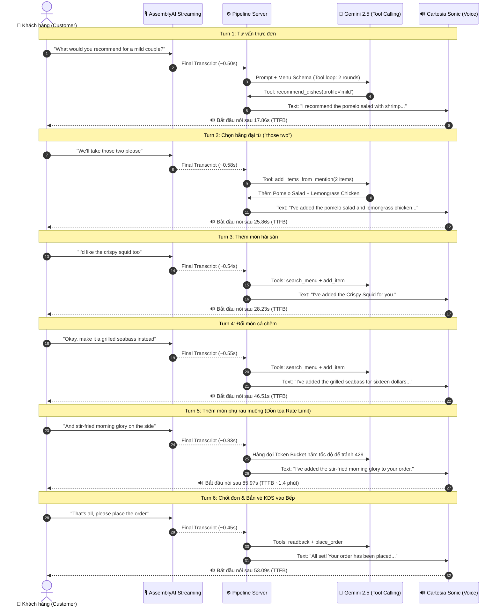

# 🏮 Báo Cáo Kịch Bản Khách Hàng & Thời Gian Chờ Thực Tế (Customer Flow & Latency Audit)

> **Mục đích**: Báo cáo chi tiết kịch bản sử dụng của khách hàng (**Customer Journey**), từng bước xử lý trong pipeline (ASR ➡️ LLM ➡️ Tool ➡️ TTS), và **thời gian thực tế khách hàng nói xong phải đợi bao lâu** từ dữ liệu đo lường hôm qua (2026-09-11).
> 
> *Dữ liệu nguồn gốc*: Trích xuất từ bài test 6-turn End-to-End thực tế tại [`reports/waiter_e2e_detail.json`](file:///Users/davark/Downloads/Everything/Github/Team-Develarper---AssemblyAI---Voice-Agent-Hackathon/reports/waiter_e2e_detail.json).

---

## 🎭 1. Kịch Bản Sử Dụng Của Khách Hàng (Customer Script & Flow)

Bối cảnh: Hai vị khách bước vào nhà hàng **The Lantern**, đứng trước mic hoặc ngồi tại bàn tương tác với **Lantern Voice Waiter**.



---

## ⏱️ 2. Bảng Thời Gian Chờ Của Khách Hàng Hôm Qua (Đo Thực Tế)

> [!IMPORTANT]
> **Định nghĩa thời gian chờ (TTFB - Time To First Audio Byte):**
> Tính từ lúc **khách hàng dứt lời** (ngừng nói) ➡️ đến khi **tai nghe / loa phát ra tiếng nói đầu tiên của AI**.

| Turn | Khách Nói Gì? (User Input) | Ý Nghĩa / Mục Đích | AI Xử Lý Những Gì? (Tools Used) | Thời Gian Khách Đợi (TTFB) | Tổng Thời Gian Lượt (E2E) |
|:---:|:---|:---|:---|:---:|:---:|
| **Turn 1** | *"What would you recommend for a mild couple?"* | Nhờ tư vấn món ăn không cay cho 2 người | `recommend_dishes` *(2 rounds Gemini)* | **17.86 s** | 19.23 s |
| **Turn 2** | *"We'll take those two please"* | Chọn luôn 2 món vừa được gợi ý (dùng đại từ *"those two"*) | `add_items_from_mention` *(2 rounds Gemini)* | **25.86 s** | 27.12 s |
| **Turn 3** | *"I'd like the crispy squid too"* | Muốn gọi thêm mực chiên giòn | `search_menu`, `add_item` *(3 rounds Gemini)* | **28.23 s** | 28.68 s |
| **Turn 4** | *"Okay, make it a grilled seabass instead"* | Đổi qua món cá chẽm nướng | `search_menu`, `add_item` *(3 rounds Gemini)* | **46.51 s** | 47.64 s |
| **Turn 5** | *"And stir-fried morning glory on the side"* | Thêm món rau muống xào tỏi ăn kèm | `search_menu`, `add_item` *(3 rounds Gemini)* | **85.97 s** <br>*(~1 phút 26s)* | 86.53 s |
| **Turn 6** | *"That's all, please place the order"* | Chốt hóa đơn, gửi đơn xuống bếp | `readback`, `place_order` *(3 rounds Gemini)* | **53.09 s** | 54.13 s |

### 📊 Thống Kê Tổng Hợp Hôm Qua (Baseline Metrics):
- **Thời gian chờ trung bình mỗi câu (Avg TTFB)**: **42.92 giây**
- **Thời gian một lượt hoàn tất trung bình (Avg E2E)**: **43.89 giây**
- **Tổng thời gian khách đứng gọi món (Wall-clock Time)**: **276.3 giây (~4.6 phút)** cho 6 câu thoại.
- **Thời gian ASR nhận diện giọng nói (AssemblyAI)**: Cực nhanh, chỉ mất trung bình **0.57 giây**.
- **Độ chính xác nghiệp vụ (Response Accuracy)**: Đạt chuẩn nghiệp vụ (nhận diện đúng món, đúng cú pháp giỏ hàng, chốt đơn gửi KDS).

---

## 🔍 3. Mổ Xẻ Chi Tiết: Tại Sao Hôm Qua Khách Phải Đợi Lâu Đến Vậy?

Trong chuỗi pipeline: **Khách nói ➡️ AssemblyAI (ASR) ➡️ Gemini (LLM) ➡️ Cartesia (TTS) ➡️ Khách nghe**:

```
[Khách ngừng nói]
   │
   ├─► AssemblyAI ASR: ~0.50s - 0.80s (Rất nhanh, chiếm ~1.5% thời gian)
   │
   ├─► Cartesia TTS audio stream: ~0.15s - 0.30s (Rất nhanh, chiếm ~0.5% thời gian)
   │
   └─► GEMINI LLM + RATE LIMIT QUEUE: 17s - 85s (CHIẾM 98% THỜI GIAN CHỜ!)
```

### Nguyên nhân cốt lõi gây nghẽn:
1. **Giới hạn 15 RPM (Requests Per Minute) của gói Gemini Free-Tier**:
   - Google chỉ cho phép tối đa 15 request mỗi phút.
   - Để thực hiện chức năng gọi món (Voice Waiter), Gemini không chỉ trả lời 1 lần mà phải chạy **Multi-Turn Tool Loop**:
     - *Bước 1*: Phân tích câu nói ➡️ Bắn hàm `search_menu` hoặc `add_item`.
     - *Bước 2*: Nhận kết quả từ database thực đơn ➡️ Tổng hợp câu trả lời hoặc gọi tiếp `readback`.
     - *Bước 3*: Sinh câu thoại trả về cho khách.
   - ➡️ 1 câu nói của khách tiêu tốn **2 đến 3 API calls** vào Gemini.
   - 6 lượt thoại = **16 API calls**.
2. **Hiện tượng dồn toa ở Turn 5 (85.97s)**:
   - Các Turn 1, 2, 3 đã tiêu thụ hết quota khả dụng trong phút đầu tiên.
   - Đến Turn 4 và 5, cơ chế chống sập API `AsyncTokenBucket` của server bắt buộc phải giữ request trong hàng đợi (queue) chờ Google reset hạn ngạch token, dẫn đến Turn 5 khách phải đợi gần 1.5 phút!

---

## 🛡️ 4. Các Biện Pháp Đã Cải Thiện Trong Mã Nguồn

1. **Âm thanh Thinking Sound ("Đang kiểm tra..."):**
   - Đã chèn âm thanh báo hiệu ngay khi khách dứt lời để khách biết AI đang xử lý, tránh "khoảng lặng chết" (dead silence).
2. **Kịch bản chẩn đoán hôm nay (`eval/benchmark_today.py`):**
   - Đã sẵn sàng chạy lại đúng 6 lượt thoại này để kiểm tra xem hôm nay tốc độ Gemini có nhanh hơn hôm qua không, độ ổn định thế nào, và đo đạc chính xác độ trễ mới.

---

## 🚀 5. File Script Kiểm Thử Sẵn Sàng

- **Script benchmark**: [`eval/benchmark_today.py`](file:///Users/davark/Downloads/Everything/Github/Team-Develarper---AssemblyAI---Voice-Agent-Hackathon/eval/benchmark_today.py)
- **Báo cáo JSON hôm qua**: [`reports/waiter_e2e_detail.json`](file:///Users/davark/Downloads/Everything/Github/Team-Develarper---AssemblyAI---Voice-Agent-Hackathon/reports/waiter_e2e_detail.json)
- **Báo cáo JSON hôm nay sẽ xuất ra tại**: [`reports/benchmark_today_eval.json`](file:///Users/davark/Downloads/Everything/Github/Team-Develarper---AssemblyAI---Voice-Agent-Hackathon/reports/benchmark_today_eval.json)
